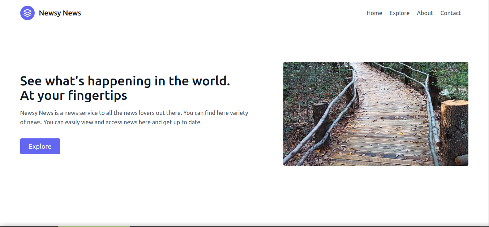
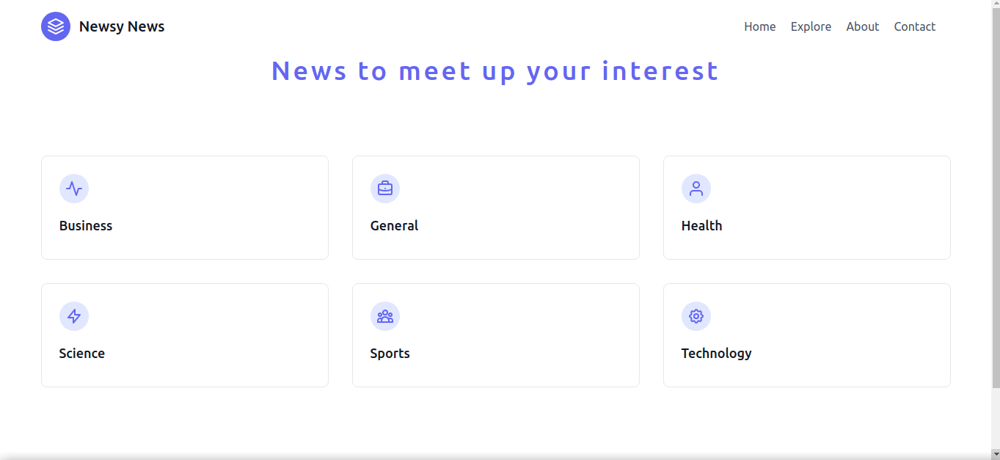
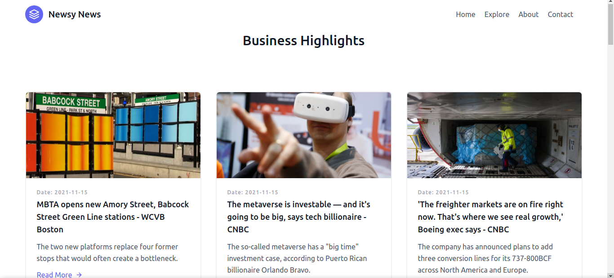
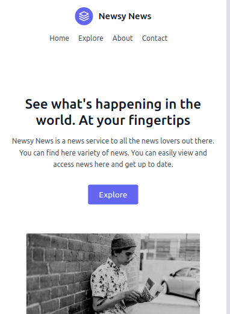
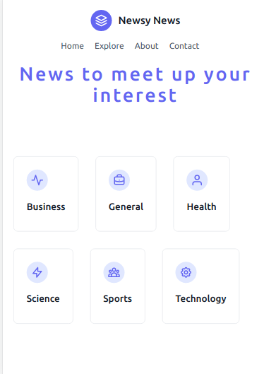
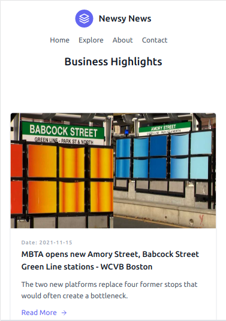

News Lover?
Checkout this:
Usage:
1. clone this repo to your local machine
2. install vscode and liveserver
3. open this folder in vscode and launch it live.
4. sit back.
5. relax
6. enjoy the news.
Website Snapshots:

Explore Section:

Category:

<h1>Mobile View</h1>

